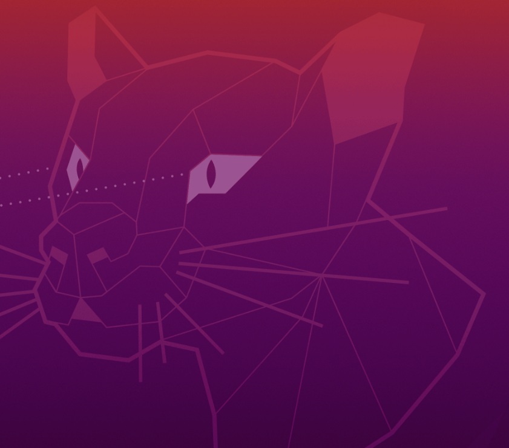

# OFA-image-captioning
image captioning by OFA

## 準備

### 仮想環境

```
conda env create -n ofa -f ofa.yml
```

### インストール
モデルのインストール

OFA-hugeの場合
```
sudo apt-get install git-lfs
git lfs clone https://huggingface.co/OFA-Sys/OFA-huge
```

その他のサイズは以下を参照
https://huggingface.co/OFA-Sys

## 実行
```
python main.py --image_path "./test.png" --ckpt_dir "./OFA-huge"
```

## 結果例


**purple abstract irregular polygonal illustration, which consist of triangles.**

## 参考

OFA-huge
https://huggingface.co/OFA-Sys/ofa-huge

